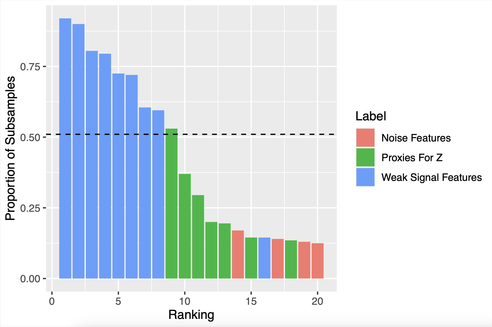

# cssr-project

## Installing the cssr Package

You can install the cssr package using the following command:

``` r
remotes::install_github("gregfaletto/cssr-project", subdir = "cssr")
```

The cssr package implements [cluster stability selection (Faletto and Bien 2022)](https://arxiv.org/abs/2201.00494), a feature selection method. Given data $(X, y)$, cluster stability selection selects the variables in $X$ that are useful for predicting $y$.


```{r}
library(cssr)
# Generate some data containing clusters of highly correlated features
data <- genClusteredData(n = 80, # Sample size
                         p = 40, # Number of features 
                         cluster_size = 10, # Number of features in a cluster correlated with a latent variable
                         k_unclustered = 10, # Number of unclustered features that influence y
                         snr = 3 # Signal-to-noise ratio in the response y generated from the data.
                         )

X <- data$X
y <- data$y

output <- cssSelect(X, y)

output$selected_feats
```

I'll first walk through a description of [stability selection (Meinshausen and Bühlmann, 2010)](https://arxiv.org/abs/0809.2932), the method that cluster stability selection builds on. Then I'll illustrate a problem with stability selection when data with clusters of highly correlated features are observed. Finally, I'll demonstrate how to use the cssr package to implement cluster stability selection.

## Stability Selection

Cluster stability selection is an extension of [stability selection (Meinshausen and Bühlmann, 2010)](https://arxiv.org/abs/0809.2932). Stability selection is a procedure deisgned to make any feature selection procedure more *stable*. Given a data set $(\boldsymbol{X}, \boldsymbol{y})$ with $n$ observations, stability selection works as follows:

* The data are divided into $B$ subsamples of size $n/2$ (typically, $B$ might be around 50 or 100).
* The desired feature selection method is run on each subsample, yielding $B$ selected sets of features.
* For each feature, we count how many times it was selected and divide by $B$ to get a *selection proportion*. We interpret the selection proportion for each feature as a measure of feature importance--the higher the selection proportion is for a feature, the more relevant we think it is for predicting $y$.
* Finally, we use the selection proportions to get a selected set (for example, by taking the top $s$ features for some predetermined $s$).

The below diagram (from Faletto and Bien 2022) demonstrates the procedure. In the diagram, the lasso is the chosen feature selection procedure, and a selected set is chosen by choosing all features with selection proportions larger than a predetermined $\tau$.


In the classic framework of [bias/variance tradeoff](https://en.wikipedia.org/wiki/Bias%E2%80%93variance_tradeoff), we can think of stability selection as a way to reduce variance at the price of increasing bias. We get a more stable and robust (lower variance) feature selection procedure because we average over many subsamples, but the price we pay is that each selected set is estimated using a sample of size $n/2$ rather than $n$.

# Why Cluster Stability Selection?

**Stability selection doesn't do well when features are highly correlated.** The problem is that if there are clusters of highly correlated features, any one member of the cluster might be a reasonably good choice for a predictive model. So the base feature selection might select one cluster member more or less at random. Then at the end, no one cluster member will have a high selection proportion, so no cluster member will be selected as an important feature, even if every selected set contained a cluster member. This problem has been called "vote-splitting."

In [our paper](https://arxiv.org/abs/2201.00494), we walk through an example where there is a latent (unobserved) feature $Z$ that is important for predicting $y$. $Z$ is not observed, but 10 *proxies* for $Z$ are observed--features that are highly correlated with $Z$ and therefore with each other. There are also 10 "weak signal" features that influence $y$, but less so than $Z$. We show in a simulation study that stability selection tends to end up with low selection proportions for the proxies for $Z$, even though any one of the $Z$ proxies would be more useful for predicting $y$ than all of the "weak signal" features. 

The below figure shows the selection proportions yielded by stability selection for proxies for $Z$, "weak signal" features, and "noise" features that are unrelated to $y$.



## How does cluster stability selection fix this?

Cluster stability selection modifies stability selection with a simple fix: instead of only keeping track of the individual feature selection proportions, we also keep track of the *cluster selection proportions*--the proportion of subsamples in which at least one cluster member was selected. Then we can rank clusters by their importance according to cluster selection proportion, and select entire clusters. This avoids the vote-splitting problem!

## Using the cssr package to implement cluster stability selection

The data we generated at the beginning of third document contain a cluster of 10 features (specifically, the first 10 columns of $X$) that are highly correlated both with each other and also with an unobserved variable $Z$ that is associated with $y$. The cssSelect function in the cssr package yields a set of features selected by cluster stability selection. We can tell cssSelect about the cluster using the "clusters" argument.

```{r}
clus_output <- cssSelect(X, y, clusters=list("Z_cluster"=1:10))
```

This input tells cssSelect that features 1 through 10 are in a cluster, and it names the cluster "Z_cluster" (providing a name is optional and is only for your convenience). cssSelect returns both a set of selected clusters (below) and all of the features contained within those clusters (as in the above).

```{r}
clus_output$selected_clusts

clus_output$selected_feats
```


vignette incomplete past this point...

Here's a brief summary of how cluster stability selection works: besides the data $(X, y)$, cluster stability selection also requires a "base" feature selection method, and can also accept a tuning parameter for that method. (The default feature selection method is the lasso, which as tuning parameter lambda.) Cluster stability selection takes a large number $B$ of subsamples of size $n/2$ and runs the feature selection method on each subsample, yielding $B$ selected sets.

```{r}
clusters <- list("Z_clust"=1:10, 36:40)

# Wrapper functions (easy!)
n_test <- 50
n <- 80
p <- 40
testx <- matrix(rnorm(n_test*p), nrow=n_test, ncol=p)

cssPredict(X, y, testx, clusters)

# Get a good lambda
lambda <- getLassoLambda(X, y)

# clusters <- list(1:10, 46:40)
# clusters <- 1:10

inds <- 1:40

results <- css(X=X, y=y, lambda=lambda
               , clusters=clusters
               # , clusters=list()
               # , clusters=1:10
               # , sampling.type = "SS"
               # B = 100,
               # , prop_feats_remove = .5
               , train_inds = inds
)

str(results)

predictions <- results |> getCssPreds(testX = testx, weighting="sparse",
                                      cutoff=0.3
                                      , min_num_clusts=1
                                      , max_num_clusts=3
)
predictions

train_x <- matrix(rnorm(n_test*p), nrow=n_test, ncol=p)
train_y <- rnorm(n_test)

preds2 <- results |> getCssPreds(testX = testx, weighting="sparse",
                                 cutoff=0.3, min_num_clusts=1, max_num_clusts=3,
                                 trainX=train_x
                                 , trainY=train_y)

preds2

selections <- results |> getCssSelections(weighting="sparse", cutoff=0.3
                                          # , min_num_clusts=1
                                          # , max_num_clusts=3
)

str(selections)

selections$selected_clusts
selections$selected_feats

print(results, cutoff=0.3, max_num_clusts=5)

x_design <- results |> getCssDesign(testx, weighting="weighted_avg", cutoff=0.3,
  min_num_clusts=1, max_num_clusts=3)

str(x_design)
```
