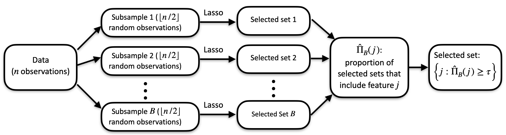

# cssr-project

## Getting started

You can install the cssr package using the following command:

``` r
remotes::install_github("gregfaletto/cssr-project", subdir = "cssr")
```

The cssr package implements cluster stability selection (read [our paper](https://arxiv.org/abs/2201.00494) for details), a feature selection method. Given data $(X, y)$, cluster stability selection selects the variables in $X$ that are useful for predicting $y$.


```{r}
library(cssr)
# Generate some data containing clusters of highly correlated features
data <- genClusteredData(n = 80, # Sample size
                         p = 40, # Number of features 
                         cluster_size = 10, # Number of features in a cluster correlated with a latent variable
                         k_unclustered = 10, # Number of unclustered features that influence y
                         snr = 3 # Signal-to-noise ratio in the response y generated from the data.
                         )

X <- data$X
y <- data$y

output <- cssSelect(X, y)

output$selected_feats
```




Cluster stability selection is designed to be particularly useful for data that include clustered features--groups of highly correlated features. The data we generated above contain a cluster of 10 features (specifically, the first 10 columns of $X$) that are highly correlated both with each other and also with an unobserved variable $Z$ that is associated with $y$. We can tell cluster stability selection about this cluster using the "clusters" argument.

```{r}
clus_output <- cssSelect(X, y, clusters=list("Z_cluster"=1:10))

clus_output$selected_feats
```

(Note that in our generated data, features 11 through 20 are also associated with y.) Cluster stability selection returns both a set of selected clusters (below) and all of the features contained within those clusters (as in the above).

```{r}
clus_output$selected_clusts
```

Here's a brief summary of how cluster stability selection works: besides the data $(X, y)$, cluster stability selection also requires a "base" feature selection method, and can also accept a tuning parameter for that method. (The default feature selection method is the lasso, which as tuning parameter lambda.) Cluster stability selection takes a large number $B$ of subsamples of size $n/2$ and runs the feature selection method on each subsample, yielding $B$ selected sets.


need to finish vignette...

```{r}
clusters <- list("Z_clust"=1:10, 36:40)

# Wrapper functions (easy!)
n_test <- 50
n <- 80
p <- 40
testx <- matrix(rnorm(n_test*p), nrow=n_test, ncol=p)

cssPredict(X, y, testx, clusters)

# Get a good lambda
lambda <- getLassoLambda(X, y)

# clusters <- list(1:10, 46:40)
# clusters <- 1:10

inds <- 1:40

results <- css(X=X, y=y, lambda=lambda
               , clusters=clusters
               # , clusters=list()
               # , clusters=1:10
               # , sampling.type = "SS"
               # B = 100,
               # , prop_feats_remove = .5
               , train_inds = inds
)

str(results)

predictions <- results |> getCssPreds(testX = testx, weighting="sparse",
                                      cutoff=0.3
                                      , min_num_clusts=1
                                      , max_num_clusts=3
)
predictions

train_x <- matrix(rnorm(n_test*p), nrow=n_test, ncol=p)
train_y <- rnorm(n_test)

preds2 <- results |> getCssPreds(testX = testx, weighting="sparse",
                                 cutoff=0.3, min_num_clusts=1, max_num_clusts=3,
                                 trainX=train_x
                                 , trainY=train_y)

preds2

selections <- results |> getCssSelections(weighting="sparse", cutoff=0.3
                                          # , min_num_clusts=1
                                          # , max_num_clusts=3
)

str(selections)

selections$selected_clusts
selections$selected_feats

print(results, cutoff=0.3, max_num_clusts=5)

x_design <- results |> getCssDesign(testx, weighting="weighted_avg", cutoff=0.3,
  min_num_clusts=1, max_num_clusts=3)

str(x_design)
```
