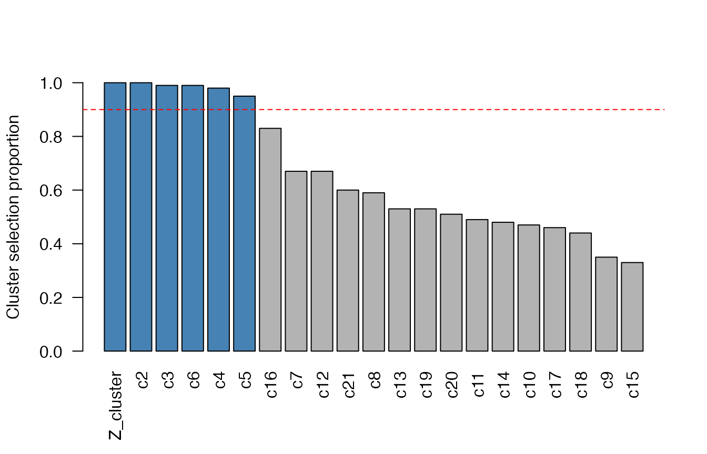
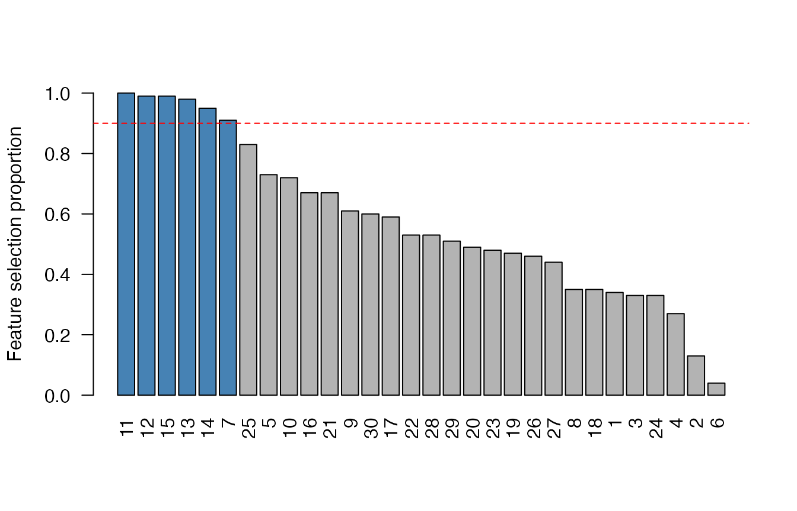

# Exploring cluster stability selection results

The getting-started guide (the package [home
page](https://gregfaletto.github.io/cssr-project/)) shows how to *run*
cluster stability selection with [`css()`](../reference/css.md). This
vignette shows how to **explore and visualize** a fitted `cssr` object
using its S3 methods:
[`plot()`](https://rdrr.io/r/graphics/plot.default.html),
[`print()`](https://rdrr.io/r/base/print.html),
[`summary()`](https://rdrr.io/r/base/summary.html), and
[`selected()`](../reference/selected.md). All of them read the
already-computed selection proportions, so they are cheap to call and
let you explore different `cutoff`s without re-running the (relatively
expensive) subsampling.

``` r
library(cssr)
set.seed(983219)

# Data with a cluster of 10 correlated proxies for a latent variable (features
# 1-10), plus some unclustered "weak signal" features and noise.
data <- genClusteredData(n = 80, p = 30, cluster_size = 10,
                         k_unclustered = 5, snr = 3)
X <- data$X
y <- data$y

# css() needs a lambda; getLassoLambda() picks one by cross-validation.
lambda <- getLassoLambda(X, y)

# Run cluster stability selection, telling css about the cluster of proxies.
css_output <- css(X, y, lambda, clusters = list("Z_cluster" = 1:10))
```

## Visualizing selection proportions with `plot()`

[`plot()`](https://rdrr.io/r/graphics/plot.default.html) draws a sorted
bar plot of the **cluster selection proportions** – the proportion of
subsamples in which each cluster was selected. The clusters selected at
the given `cutoff` are highlighted, and the cutoff is drawn as a dashed
reference line.

``` r
plot(css_output, cutoff = 0.9)
```



`"Z_cluster"` (the cluster of proxies) rises to the top – exactly the
vote-splitting fix that cluster stability selection provides. Pass
`type = "features"` to plot the individual-feature selection proportions
instead:

``` r
plot(css_output, type = "features", cutoff = 0.9)
```



## Tabular summaries: `print()` and `summary()`

Printing a `cssr` object shows one row per cluster, in decreasing order
of selection proportion, with each cluster’s prototype (its
highest-selected member) and size:

``` r
print(css_output, cutoff = 0.9)
#>   ClustName ClustProtoNum ClustSelProp ClustSize
#> 1 Z_cluster             7         1.00        10
#> 2        c2            11         1.00         1
#> 3        c3            12         0.99         1
#> 4        c6            15         0.99         1
#> 5        c4            13         0.98         1
#> 6        c5            14         0.95         1
```

[`summary()`](https://rdrr.io/r/base/summary.html) returns a computable
overview (the selection counts plus the per-cluster table) with its own
print method:

``` r
summary(css_output, cutoff = 0.9)
#> Cluster stability selection summary
#> 6 clusters / 6 features selected at cutoff 0.9
#> 
#>   ClustName ClustProtoNum ClustSelProp ClustSize
#> 1 Z_cluster             7         1.00        10
#> 2        c2            11         1.00         1
#> 3        c3            12         0.99         1
#> 4        c6            15         0.99         1
#> 5        c4            13         0.98         1
#> 6        c5            14         0.95         1
#> 
#> PFER: NA (not yet implemented; see issue #87)
```

## Extracting the selection with `selected()`

[`selected()`](../reference/selected.md) returns the selected clusters
directly – a named list giving the feature indices in each. Pass
`type = "features"` for the flat vector of all selected features:

``` r
selected(css_output, cutoff = 0.9)
#> $Z_cluster
#>  [1]  1  2  3  4  5  6  7  8  9 10
#> 
#> $c2
#> [1] 11
#> 
#> $c3
#> [1] 12
#> 
#> $c4
#> [1] 13
#> 
#> $c5
#> [1] 14
#> 
#> $c6
#> [1] 15

selected(css_output, type = "features", cutoff = 0.9)
#> [1]  7 11 12 13 14 15
```

[`plot()`](https://rdrr.io/r/graphics/plot.default.html),
[`print()`](https://rdrr.io/r/base/print.html),
[`summary()`](https://rdrr.io/r/base/summary.html), and
[`selected()`](../reference/selected.md) all share the same `cutoff` /
`min_num_clusts` / `max_num_clusts` arguments, so you can dial the
selection in without re-running [`css()`](../reference/css.md).

## See also

- The getting-started guide (package [home
  page](https://gregfaletto.github.io/cssr-project/)) for running
  [`css()`](../reference/css.md) and
  [`cssSelect()`](../reference/cssSelect.md).
- [`vignette("prediction", "cssr")`](../articles/prediction.md) for
  predicting `y` on new observations with cluster representatives.
- [`?plot.cssr`](../reference/plot.cssr.md),
  [`?summary.cssr`](../reference/summary.cssr.md),
  [`?selected`](../reference/selected.md), and
  [`?getCssSelections`](../reference/getCssSelections.md) for the full
  argument reference.
